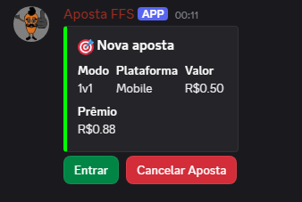
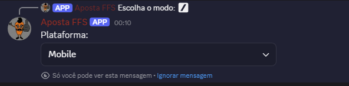
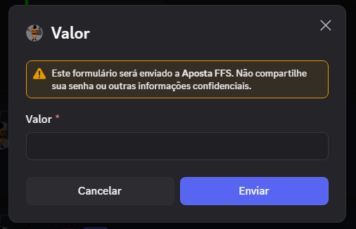
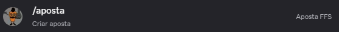
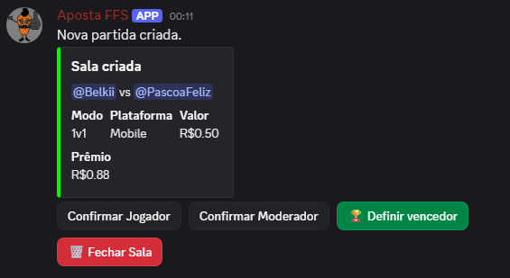
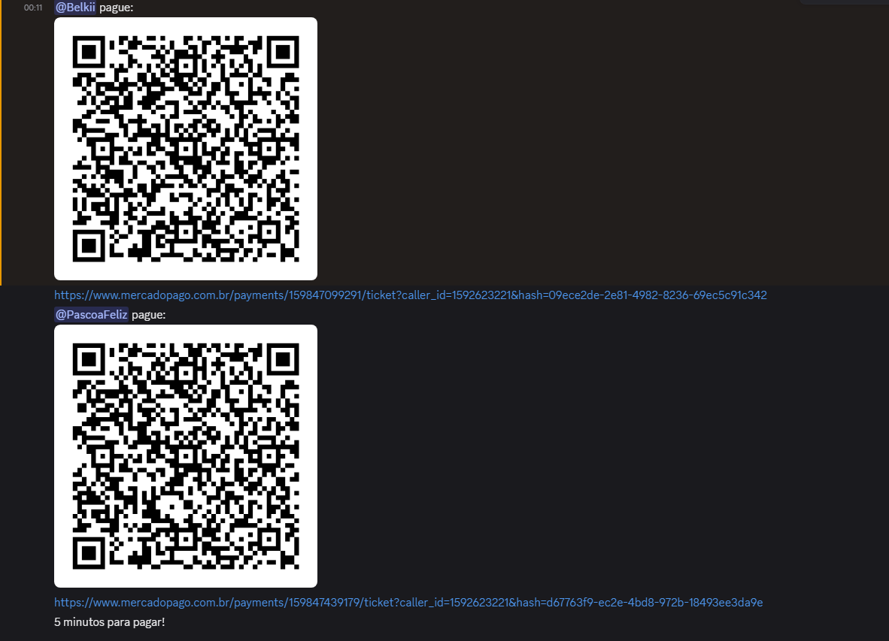
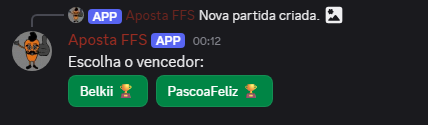

# Discord Betting Bot

Bot de apostas para Discord integrado com Mercado Pago PIX.

## Funcionalidades

- Sistema de apostas:
  - 1v1
  - 2v2
  - 3v3
  - 4v4

- Integração com PIX Mercado Pago
- Criação automática de salas privadas
- Sistema de confirmação de moderador
- Confirmação de jogadores
- Timeout automático para pagamentos
- Sistema de logs
- Sistema de definição de vencedor

---

## Tecnologias

- Python
- discord.py
- Mercado Pago SDK
- Railway
- dotenv

---

## Instalação

Clone o projeto:

```bash
git clone https://github.com/Viztor-11/Bot-api-pix.git
```

Entre na pasta:

```bash
cd Bot-api-pix
```

Instale as dependências:

```bash
pip install -r requirements.txt
```

---

## Configuração

Crie um arquivo `.env`

```env
TOKEN=SEU_TOKEN_DISCORD
MP_ACCESS_TOKEN=SEU_TOKEN_MERCADO_PAGO
MOD_ROLE_ID=ID_DO_CARGO
LOG_CHANNEL_ID=ID_DO_CANAL
```

---

## Executar localmente

```bash
python main.py
```

---

## Hospedagem

O projeto pode ser hospedado usando:

- Railway
- Render
- VPS Linux

---

## Estrutura do projeto

```text
Bot-api-pix/
│
├── images/
├── services/
├── views/
├── utils/
│
├── main.py
├── config.py
├── data.py
├── requirements.txt
├── .env.example
└── README.md
```

---

## Preview

### Tela inicial



---

### Seleção de modo


---

### Escolha da plataforma



---

### Inserção do valor



---

### Nova aposta criada



---

### Sala privada criada



---

### Pagamento PIX



---

### Resultado da partida



---

## Licença

Este projeto utiliza a licença MIT.